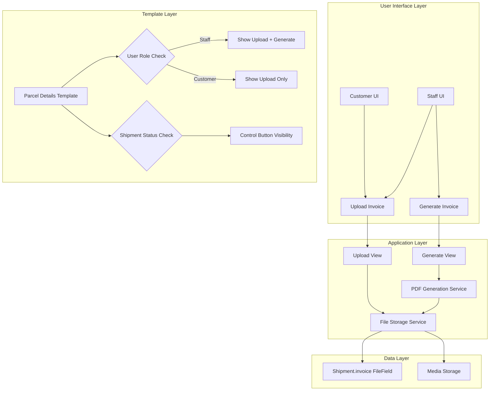

# Design Document: Commercial Invoice System

## Overview

The Commercial Invoice System extends the existing Django-based export/import shipment management application to support invoice management. The system enables both staff and customers to manage a single invoice file per shipment through two methods: uploading pre-existing invoice documents or generating invoices with product line items.

### Key Design Principles

- **Simplicity**: Single invoice field on Shipment model, no separate invoice models
- **Flexibility**: Support both uploaded and generated invoices in the same field
- **Permission Enforcement**: Template-based conditional rendering (no view-level checks)
- **Temporary Data**: Product line items exist only during PDF generation
- **Staff Override**: Staff can edit shipper/consignee for PDF without database updates

### System Context

The system integrates into an existing Django application with:
- User authentication (staff and customer roles)
- Shipment model with status workflow (PENDING → BOOKED → IN_TRANSIT → DELIVERED)
- Customer model linked to User accounts
- Template-based UI with Bootstrap styling
- File storage configured via Django's MEDIA_ROOT

## Architecture

### High-Level Architecture



### Component Interaction Flow

**Upload Flow:**
1. User selects invoice file in UI
2. Form submits to upload view with file and shipment ID
3. View validates file (format, size)
4. File saved to media storage
5. Shipment.invoice field updated with file reference
6. Template re-renders with download/preview buttons

**Generation Flow:**
1. Staff accesses generation form (pre-populated with shipment data)
2. Staff edits shipper/consignee (optional) and adds product line items
3. Form submits to generation view
4. View validates data (AWB exists, line items valid)
5. PDF generation service creates invoice PDF
6. PDF saved to media storage
7. Shipment.invoice field updated with PDF reference
8. Template re-renders with download/preview buttons

**Deletion Flow:**
1. User clicks delete button (visible based on role + status)
2. Confirmation modal appears
3. Delete view removes file from storage
4. Shipment.invoice field cleared
5. Template re-renders with upload/generate options

## Components and Interfaces

### Database Schema Changes

#### Shipment Model Updates

```python
class Shipment(models.Model):
    # ... existing fields ...
    
    # New fields for invoice system
    invoice = models.FileField(
        upload_to='invoices/%Y/%m/',
        blank=True,
        null=True,
        help_text="Commercial invoice document (uploaded or generated)"
    )
    has_commercial_value = models.BooleanField(
        default=True,
        help_text="False for shipments with no commercial value"
    )
```

**Field Specifications:**
- `invoice`: FileField storing single invoice file (PDF or image)
  - Upload path: `media/invoices/YYYY/MM/filename.ext`
  - Accepts: PDF, JPG, PNG formats
  - Max size: 10MB (validated in view)
  - Nullable: Yes (shipments may not have invoices)
  
- `has_commercial_value`: Boolean flag
  - Default: True
  - Controls invoice generation behavior
  - When False: generates simplified "NO COMMERCIAL VALUE" invoice

**Migration Strategy:**
- Add fields with null=True, blank=True
- No data migration needed (new feature)
- Existing shipments will have invoice=None by default

### URL Routing

```python
# exportimport/urls.py additions

urlpatterns = [
    # ... existing patterns ...
    
    # Invoice operations
    path('parcels/<int:shipment_id>/invoice/upload/', 
         views.upload_invoice, 
         name='upload_invoice'),
    
    path('parcels/<int:shipment_id>/invoice/generate/', 
         views.generate_invoice_form, 
         name='generate_invoice_form'),
    
    path('parcels/<int:shipment_id>/invoice/create/', 
         views.create_invoice_pdf, 
         name='create_invoice_pdf'),
    
    path('parcels/<int:shipment_id>/invoice/download/', 
         views.download_invoice, 
         name='download_invoice'),
    
    path('parcels/<int:shipment_id>/invoice/delete/', 
         views.delete_invoice, 
         name='delete_invoice'),
]
```

**URL Design Rationale:**
- RESTful structure: `/parcels/{id}/invoice/{action}/`
- Consistent with existing parcel URL patterns
- Separate form display (`generate_invoice_form`) from PDF creation (`create_invoice_pdf`)
- All operations scoped to specific shipment

### View Functions

#### 1. Upload Invoice View

```python
@login_required
@require_http_methods(["POST"])
def upload_invoice(request, shipment_id):
    """
    Upload invoice file for a shipment.
    
    Permissions:
    - Staff: Can upload anytime
    - Customer: Can upload only for their own shipments
    
    Validation:
    - File format: PDF, JPG, PNG
    - File size: Max 10MB
    - Shipment ownership (for customers)
    """
```

**Responsibilities:**
- Validate file format and size
- Check shipment ownership for customers
- Save file to media storage
- Update Shipment.invoice field
- Return JSON response with success/error

**Error Handling:**
- Invalid file format → 400 with error message
- File too large → 400 with error message
- Shipment not found → 404
- Access denied → 403 (customer accessing other's shipment)

#### 2. Generate Invoice Form View

```python
@login_required
@staff_member_required
def generate_invoice_form(request, shipment_id):
    """
    Display invoice generation form (staff only).
    
    Pre-populates:
    - Shipper name/address from shipment
    - Consignee name/address from shipment
    - AWB number (read-only)
    - Currency from shipment.declared_currency
    
    Validation:
    - Shipment must have AWB number
    - Shipment must not already have invoice
    """
```

**Responsibilities:**
- Render form with pre-populated shipment data
- Display AWB as read-only field
- Provide dynamic product line item rows (JavaScript)
- Handle has_commercial_value checkbox

**Template Context:**
```python
{
    'shipment': shipment,
    'shipper_name': shipment.shipper_name,
    'shipper_address': shipment.shipper_address,
    'consignee_name': shipment.recipient_name,
    'consignee_address': shipment.recipient_address,
    'awb_number': shipment.awb_number,
    'currency': shipment.declared_currency,
    'has_commercial_value': shipment.has_commercial_value,
}
```

#### 3. Create Invoice PDF View

```python
@login_required
@staff_member_required
@require_http_methods(["POST"])
def create_invoice_pdf(request, shipment_id):
    """
    Generate PDF invoice from form data.
    
    Input (JSON):
    - shipper_name, shipper_address (editable)
    - consignee_name, consignee_address (editable)
    - has_commercial_value (boolean)
    - line_items: [
        {description, weight, quantity, unit_value},
        ...
      ]
    
    Validation:
    - AWB must exist
    - If has_commercial_value=True: require at least 1 line item
    - All line item fields must be non-empty
    - Numeric fields must be positive
    
    Process:
    - Generate PDF using edited shipper/consignee
    - Do NOT update shipment database fields
    - Save PDF to media storage
    - Update Shipment.invoice field
    """
```

**Responsibilities:**
- Parse and validate form data
- Call PDF generation service
- Save generated PDF
- Update Shipment.invoice field
- Return JSON response

**Data Flow:**
```
Form Data → Validation → PDF Service → File Storage → Database Update → Response
```

#### 4. Download Invoice View

```python
@login_required
def download_invoice(request, shipment_id):
    """
    Serve invoice file for download.
    
    Permissions:
    - Staff: Can download anytime
    - Customer: Can download only if status is BOOKED or later
    
    Response:
    - Content-Type: application/pdf or image/*
    - Content-Disposition: attachment; filename="invoice_{awb}.pdf"
    """
```

**Responsibilities:**
- Check permissions (template handles visibility, but view validates)
- Serve file with appropriate headers
- Handle missing file gracefully

#### 5. Delete Invoice View

```python
@login_required
@require_http_methods(["POST"])
def delete_invoice(request, shipment_id):
    """
    Delete invoice file.
    
    Permissions:
    - Staff: Can delete anytime
    - Customer: Can delete only if status is PENDING
    
    Process:
    - Delete file from storage
    - Clear Shipment.invoice field
    """
```

**Responsibilities:**
- Check permissions
- Delete file from storage
- Clear database field
- Return JSON response

### Form Design

#### Invoice Generation Form

```python
# exportimport/forms.py

class InvoiceGenerationForm(forms.Form):
    """
    Form for generating commercial invoices.
    Not a ModelForm - data is temporary for PDF generation only.
    """
    
    # Editable shipper/consignee (pre-populated from shipment)
    shipper_name = forms.CharField(max_length=200, required=True)
    shipper_address = forms.CharField(widget=forms.Textarea, required=True)
    consignee_name = forms.CharField(max_length=200, required=True)
    consignee_address = forms.CharField(widget=forms.Textarea, required=True)
    
    # Read-only AWB (displayed but not editable)
    awb_number = forms.CharField(
        max_length=50, 
        required=True,
        widget=forms.TextInput(attrs={'readonly': 'readonly'})
    )
    
    # Commercial value flag
    has_commercial_value = forms.BooleanField(
        required=False,
        initial=True,
        help_text="Uncheck for shipments with no commercial value"
    )
    
    def __init__(self, *args, shipment=None, **kwargs):
        super().__init__(*args, **kwargs)
        if shipment:
            self.fields['shipper_name'].initial = shipment.shipper_name
            self.fields['shipper_address'].initial = shipment.shipper_address
            self.fields['consignee_name'].initial = shipment.recipient_name
            self.fields['consignee_address'].initial = shipment.recipient_address
            self.fields['awb_number'].initial = shipment.awb_number
            self.fields['has_commercial_value'].initial = shipment.has_commercial_value
    
    def clean_awb_number(self):
        """Ensure AWB is not modified"""
        awb = self.cleaned_data.get('awb_number')
        if not awb:
            raise ValidationError("AWB number is required")
        return awb
```

**Product Line Items:**
- Not part of Django form (handled via JavaScript)
- Submitted as JSON array in POST request
- Validated in view, not form

**Line Item Structure:**
```javascript
{
  description: string,  // Product description
  weight: decimal,      // Weight in KG
  quantity: integer,    // Quantity
  unit_value: decimal   // Value per unit in declared currency
}
```

**Frontend Validation (JavaScript):**
- At least 1 line item if has_commercial_value=true
- All fields non-empty
- Weight, quantity, unit_value are positive numbers
- Dynamic add/remove line item rows

### PDF Generation Service

#### Library Selection: ReportLab

**Rationale:**
- Pure Python library (no external dependencies)
- Excellent PDF generation capabilities
- Good documentation and community support
- Already commonly used in Django projects
- Supports custom fonts, images, tables

**Alternative Considered:**
- WeasyPrint: Requires external dependencies (Cairo, Pango)
- xhtml2pdf: Limited styling capabilities
- PyPDF2: More for PDF manipulation than generation

#### PDF Generation Service Class

```python
# exportimport/services.py

from reportlab.lib.pagesizes import letter
from reportlab.lib.units import inch
from reportlab.lib.styles import getSampleStyleSheet
from reportlab.platypus import SimpleDocTemplate, Table, TableStyle, Paragraph, Spacer
from reportlab.lib import colors
from django.core.files.base import ContentFile
import io

class InvoicePDFGenerator:
    """
    Service for generating commercial invoice PDFs.
    """
    
    def __init__(self, shipment, shipper_name, shipper_address, 
                 consignee_name, consignee_address, line_items=None):
        self.shipment = shipment
        self.shipper_name = shipper_name
        self.shipper_address = shipper_address
        self.consignee_name = consignee_name
        self.consignee_address = consignee_address
        self.line_items = line_items or []
        self.currency = shipment.declared_currency
    
    def generate(self):
        """
        Generate PDF and return ContentFile.
        
        Returns:
            ContentFile: PDF file ready to save to FileField
        """
        if not self.shipment.has_commercial_value:
            return self._generate_no_commercial_value_pdf()
        else:
            return self._generate_standard_invoice_pdf()
    
    def _generate_standard_invoice_pdf(self):
        """Generate standard invoice with line items"""
        buffer = io.BytesIO()
        doc = SimpleDocTemplate(buffer, pagesize=letter)
        elements = []
        
        # Add header
        elements.append(self._create_header())
        elements.append(Spacer(1, 0.3*inch))
        
        # Add shipper/consignee info
        elements.append(self._create_party_info())
        elements.append(Spacer(1, 0.3*inch))
        
        # Add line items table
        elements.append(self._create_line_items_table())
        elements.append(Spacer(1, 0.2*inch))
        
        # Add total
        elements.append(self._create_total())
        
        doc.build(elements)
        buffer.seek(0)
        
        filename = f"invoice_{self.shipment.awb_number}.pdf"
        return ContentFile(buffer.getvalue(), name=filename)
    
    def _generate_no_commercial_value_pdf(self):
        """Generate simplified invoice for no commercial value"""
        buffer = io.BytesIO()
        doc = SimpleDocTemplate(buffer, pagesize=letter)
        elements = []
        
        # Add header
        elements.append(self._create_header())
        elements.append(Spacer(1, 0.5*inch))
        
        # Add "NO COMMERCIAL VALUE" text
        styles = getSampleStyleSheet()
        no_value_text = Paragraph(
            "<b>NO COMMERCIAL INVOICE VALUE</b>",
            styles['Title']
        )
        elements.append(no_value_text)
        elements.append(Spacer(1, 0.3*inch))
        
        # Add AWB
        awb_text = Paragraph(
            f"<b>AWB Number:</b> {self.shipment.awb_number}",
            styles['Normal']
        )
        elements.append(awb_text)
        
        doc.build(elements)
        buffer.seek(0)
        
        filename = f"invoice_{self.shipment.awb_number}_no_value.pdf"
        return ContentFile(buffer.getvalue(), name=filename)
    
    def _create_header(self):
        """Create invoice header with company info and AWB"""
        # Implementation details...
        pass
    
    def _create_party_info(self):
        """Create shipper and consignee information section"""
        # Implementation details...
        pass
    
    def _create_line_items_table(self):
        """Create table with product line items"""
        # Table with columns: Description, Weight, Quantity, Unit Value, Total
        # Implementation details...
        pass
    
    def _create_total(self):
        """Create total value section"""
        # Implementation details...
        pass
```

**PDF Layout:**

```
┌─────────────────────────────────────────────────────┐
│  COMMERCIAL INVOICE                                 │
│  AWB: DH20240115XXXXX                              │
├─────────────────────────────────────────────────────┤
│  SHIPPER:                    CONSIGNEE:            │
│  [Name]                      [Name]                │
│  [Address]                   [Address]             │
├─────────────────────────────────────────────────────┤
│  Description  │ Weight │ Qty │ Unit Value │ Total  │
├───────────────┼────────┼─────┼────────────┼────────┤
│  Item 1       │  2.5kg │  3  │  $10.00    │ $30.00 │
│  Item 2       │  1.0kg │  1  │  $25.00    │ $25.00 │
├───────────────┴────────┴─────┴────────────┼────────┤
│                          TOTAL VALUE (USD): $55.00 │
└─────────────────────────────────────────────────────┘
```

**No Commercial Value Layout:**

```
┌─────────────────────────────────────────────────────┐
│  COMMERCIAL INVOICE                                 │
│                                                     │
│  NO COMMERCIAL INVOICE VALUE                        │
│                                                     │
│  AWB Number: DH20240115XXXXX                       │
└─────────────────────────────────────────────────────┘
```

## Data Models

### Shipment Model (Updated)

```python
class Shipment(models.Model):
    # ... existing fields ...
    
    # Invoice fields
    invoice = models.FileField(
        upload_to='invoices/%Y/%m/',
        blank=True,
        null=True,
        help_text="Commercial invoice document"
    )
    has_commercial_value = models.BooleanField(
        default=True,
        help_text="False for no commercial value shipments"
    )
    
    def has_invoice(self):
        """Check if shipment has an invoice file"""
        return bool(self.invoice)
    
    def can_generate_invoice(self):
        """Check if invoice can be generated (has AWB)"""
        return bool(self.awb_number)
    
    def get_invoice_filename(self):
        """Get invoice filename for display"""
        if self.invoice:
            return self.invoice.name.split('/')[-1]
        return None
```

**No Separate Invoice Model:**
- Product line items are NOT persisted
- Line items exist only during PDF generation
- Rationale: Simplifies data model, reduces complexity
- Trade-off: Cannot query/report on line item data

### Product Line Item (Temporary Data Structure)

```python
# Not a Django model - just a data structure for validation

@dataclass
class ProductLineItem:
    """Temporary data structure for invoice line items"""
    description: str
    weight: Decimal
    quantity: int
    unit_value: Decimal
    
    def validate(self):
        """Validate line item data"""
        errors = []
        
        if not self.description or not self.description.strip():
            errors.append("Description is required")
        
        if self.weight <= 0:
            errors.append("Weight must be positive")
        
        if self.quantity <= 0:
            errors.append("Quantity must be positive")
        
        if self.unit_value <= 0:
            errors.append("Unit value must be positive")
        
        return errors
    
    def calculate_total(self):
        """Calculate total value for this line item"""
        return self.quantity * self.unit_value
```


## Correctness Properties

*A property is a characteristic or behavior that should hold true across all valid executions of a system—essentially, a formal statement about what the system should do. Properties serve as the bridge between human-readable specifications and machine-verifiable correctness guarantees.*

### Property Reflection

After analyzing all acceptance criteria, I identified several areas where properties can be consolidated:

**Redundancies Identified:**
- Properties 5.1 and 4.18 both test PDF generation - consolidated into Property 4.18
- Properties 2.2 and 2.3 are inverse conditions - can be tested as one property with different inputs
- Properties 3.2 and 3.3 are inverse conditions - can be tested as one property with different inputs
- Properties 4.3-4.6 all test form pre-population - consolidated into one property
- Properties 4.7-4.10 all test field editability - consolidated into one property
- Properties 4.13-4.15 all test AWB field behavior - consolidated into one property
- Properties 5.2-5.7 all test PDF content - consolidated into one comprehensive property

**Final Property Set:**
After consolidation, we have 25 unique properties that provide comprehensive validation coverage without redundancy.

### Property 1: File Format Validation

*For any* file upload attempt, the system should accept the file if and only if the file extension is PDF, JPG, or PNG.

**Validates: Requirements 1.1**

### Property 2: Invoice Upload Persistence

*For any* valid invoice file upload, after the upload completes, the shipment's invoice field should reference the uploaded file.

**Validates: Requirements 1.2**

### Property 3: File Size Validation

*For any* file upload attempt, the system should reject the file if the file size exceeds 10MB and accept it if the size is 10MB or less (and format is valid).

**Validates: Requirements 1.4**

### Property 4: Customer UI Options

*For any* shipment detail page rendered for a customer user, the page should contain the upload option and should not contain the manual generation option.

**Validates: Requirements 1.5**

### Property 5: Staff UI Options

*For any* shipment detail page rendered for a staff user, the page should contain both the upload option and the manual generation option.

**Validates: Requirements 1.6**

### Property 6: Staff Download Button Visibility

*For any* shipment with an invoice, when rendered for a staff user, the page should display download and preview buttons.

**Validates: Requirements 2.1**

### Property 7: Customer Download Button Visibility

*For any* shipment with an invoice, when rendered for a customer user, the page should display download and preview buttons if and only if the shipment status is BOOKED or later.

**Validates: Requirements 2.2, 2.3**

### Property 8: Download Round Trip

*For any* uploaded invoice file, downloading the invoice should return a file with identical content to the original upload.

**Validates: Requirements 2.4**

### Property 9: No Invoice Indicator

*For any* shipment without an invoice, the rendered detail page should display an indicator that no invoice exists.

**Validates: Requirements 2.5**

### Property 10: Staff Delete Button Visibility

*For any* shipment with an invoice, when rendered for a staff user, the page should display a delete button regardless of shipment status.

**Validates: Requirements 3.1**

### Property 11: Customer Delete Button Visibility

*For any* shipment with an invoice, when rendered for a customer user, the page should display a delete button if and only if the shipment status is PENDING.

**Validates: Requirements 3.2, 3.3**

### Property 12: Invoice Deletion Removes File

*For any* shipment with an invoice, after deleting the invoice, the file should no longer exist in storage.

**Validates: Requirements 3.4**

### Property 13: Invoice Deletion Clears Field

*For any* shipment with an invoice, after deleting the invoice, the shipment's invoice field should be null.

**Validates: Requirements 3.5**

### Property 14: Post-Deletion UI State

*For any* shipment, after deleting an invoice, the rendered detail page should display upload and generation options (subject to role permissions).

**Validates: Requirements 3.6**

### Property 15: Generation Interface Visibility

*For any* shipment, the manual invoice generation interface should be visible if and only if the user is staff AND the shipment has an AWB number AND no invoice exists.

**Validates: Requirements 4.1, 4.2, 7.1, 7.3**

### Property 16: Form Pre-Population

*For any* invoice generation form, the shipper name, shipper address, consignee name, and consignee address fields should be pre-populated with the corresponding values from the shipment record.

**Validates: Requirements 4.3, 4.4, 4.5, 4.6**

### Property 17: AWB Field Behavior

*For any* invoice generation form, the AWB number field should be populated from the shipment record and should be read-only (not editable).

**Validates: Requirements 4.13, 4.14, 4.15**

### Property 18: PDF Contains Edited Values

*For any* invoice generation with edited shipper or consignee fields, the generated PDF should contain the edited values, not the original shipment values.

**Validates: Requirements 4.11**

### Property 19: Database Unchanged After Edit

*For any* invoice generation with edited shipper or consignee fields, after PDF generation, the shipment's database fields should remain unchanged (contain original values).

**Validates: Requirements 4.12**

### Property 20: PDF Generation Creates File

*For any* valid invoice generation form submission, the system should create a PDF file and store it in the shipment's invoice field.

**Validates: Requirements 4.18, 4.19**

### Property 21: Line Items Not Persisted

*For any* invoice generation with product line items, after PDF generation, no line item records should exist in the database.

**Validates: Requirements 4.20**

### Property 22: PDF Content Completeness

*For any* generated standard invoice PDF, the PDF should contain shipper name and address, consignee name and address, a table with description/weight/quantity/value columns, total value, AWB number, and the declared currency.

**Validates: Requirements 5.2, 5.3, 5.4, 5.5, 5.6, 5.7**

### Property 23: No Commercial Value PDF Format

*For any* shipment with has_commercial_value=False, the generated invoice PDF should display "NO COMMERCIAL INVOICE VALUE" text and the AWB number.

**Validates: Requirements 6.2, 6.3, 6.4**

### Property 24: No Commercial Value Validation

*For any* invoice generation with has_commercial_value=False, the system should accept the submission even if no product line items are provided.

**Validates: Requirements 6.5**

### Property 25: AWB Prerequisite Enforcement

*For any* shipment without an AWB number, invoice generation API calls should be rejected with an error.

**Validates: Requirements 7.2**

### Property 26: Commercial Value Line Item Requirement

*For any* invoice generation with has_commercial_value=True, the system should reject the submission if zero product line items are provided.

**Validates: Requirements 8.1**

### Property 27: Line Item Field Validation

*For any* product line item in an invoice generation submission, the system should reject the line item if any of the fields (description, weight, quantity, unit_value) are empty.

**Validates: Requirements 8.2**

### Property 28: Numeric Field Validation

*For any* product line item, the system should reject the line item if weight, quantity, or unit_value are not positive numbers (weight and unit_value must be > 0, quantity must be a positive integer).

**Validates: Requirements 8.3, 8.4, 8.5**

### Property 29: Validation Error Messages

*For any* invoice generation submission with validation errors, the system should return error messages that identify which specific fields are invalid.

**Validates: Requirements 8.6**

## Error Handling

### File Upload Errors

**Invalid File Format:**
- Detection: Check file extension against allowed list
- Response: HTTP 400 with JSON error message
- Message: "Invalid file format. Only PDF, JPG, and PNG files are accepted."
- User Action: Select a different file

**File Too Large:**
- Detection: Check file size before processing
- Response: HTTP 400 with JSON error message
- Message: "File size exceeds 10MB limit. Please upload a smaller file."
- User Action: Compress or select smaller file

**Storage Failure:**
- Detection: Exception during file save operation
- Response: HTTP 500 with JSON error message
- Message: "Failed to save invoice file. Please try again."
- Logging: Log full exception with stack trace
- User Action: Retry upload

### Invoice Generation Errors

**Missing AWB Number:**
- Detection: Check shipment.awb_number before rendering form
- Response: HTTP 400 with JSON error message
- Message: "Cannot generate invoice. Shipment must be booked first."
- User Action: Book the shipment to assign AWB

**No Line Items (Commercial Value):**
- Detection: Validate line_items array length
- Response: HTTP 400 with JSON error message
- Message: "At least one product line item is required for commercial invoices."
- User Action: Add line items to form

**Invalid Line Item Data:**
- Detection: Validate each line item field
- Response: HTTP 400 with JSON error message
- Message: "Invalid line item data: [specific field errors]"
- Example: "Line item 2: weight must be positive, description is required"
- User Action: Correct invalid fields

**PDF Generation Failure:**
- Detection: Exception during PDF generation
- Response: HTTP 500 with JSON error message
- Message: "Failed to generate invoice PDF. Please try again."
- Logging: Log full exception with ReportLab error details
- User Action: Retry generation

### Download Errors

**File Not Found:**
- Detection: Check if invoice file exists in storage
- Response: HTTP 404 with JSON error message
- Message: "Invoice file not found. It may have been deleted."
- User Action: Re-upload or regenerate invoice

**Permission Denied:**
- Detection: Check user role and shipment status
- Response: HTTP 403 with JSON error message
- Message: "You do not have permission to download this invoice."
- User Action: Contact staff or wait for shipment to be booked

### Delete Errors

**Permission Denied:**
- Detection: Check user role and shipment status
- Response: HTTP 403 with JSON error message
- Message: "You do not have permission to delete this invoice."
- User Action: Contact staff

**File Deletion Failure:**
- Detection: Exception during file deletion
- Response: HTTP 500 with JSON error message
- Message: "Failed to delete invoice file. Please try again."
- Logging: Log full exception
- Recovery: Clear database field even if file deletion fails
- User Action: Retry deletion

### Error Logging Strategy

**Log Levels:**
- INFO: Successful operations (upload, generate, delete)
- WARNING: Permission denials, validation failures
- ERROR: Storage failures, PDF generation failures
- CRITICAL: Database inconsistencies (file exists but field is null)

**Log Format:**
```python
logger.info(
    f"Invoice uploaded for shipment {shipment.awb_number} by user {user.username}"
)

logger.error(
    f"Failed to generate invoice for shipment {shipment.awb_number}: {str(e)}",
    exc_info=True
)
```

**Monitoring:**
- Track upload/generation success rates
- Alert on high error rates (>5% failures)
- Monitor storage usage for invoice files

## Testing Strategy

### Dual Testing Approach

The testing strategy employs both unit tests and property-based tests to ensure comprehensive coverage:

**Unit Tests:**
- Specific examples demonstrating correct behavior
- Edge cases (empty files, boundary sizes, special characters)
- Error conditions (missing AWB, invalid formats)
- Integration points (file storage, PDF generation)

**Property-Based Tests:**
- Universal properties across all inputs
- Comprehensive input coverage through randomization
- Validation of correctness properties defined in design

Together, unit tests catch concrete bugs while property tests verify general correctness across the input space.

### Property-Based Testing Configuration

**Library:** Hypothesis (Python property-based testing library)

**Configuration:**
- Minimum 100 iterations per property test
- Each test tagged with reference to design property
- Tag format: `# Feature: commercial-invoice-system, Property {number}: {property_text}`

**Example Property Test:**

```python
from hypothesis import given, strategies as st
import hypothesis

@given(
    file_extension=st.sampled_from(['pdf', 'jpg', 'png', 'doc', 'txt', 'exe'])
)
@hypothesis.settings(max_examples=100)
def test_file_format_validation(file_extension):
    """
    Feature: commercial-invoice-system, Property 1: File Format Validation
    
    For any file upload attempt, the system should accept the file if and only if
    the file extension is PDF, JPG, or PNG.
    """
    # Test implementation...
```

### Unit Test Coverage

**File Upload Tests:**
- Upload valid PDF file
- Upload valid JPG file
- Upload valid PNG file
- Upload file exactly 10MB
- Upload file over 10MB (should fail)
- Upload during shipment creation
- Upload after shipment creation
- Customer uploads to own shipment
- Customer attempts to upload to other's shipment (should fail)

**Invoice Generation Tests:**
- Generate invoice with single line item
- Generate invoice with multiple line items
- Generate invoice with edited shipper/consignee
- Generate no commercial value invoice
- Attempt generation without AWB (should fail)
- Attempt generation without line items for commercial invoice (should fail)
- Verify database fields unchanged after edit
- Verify PDF contains edited values

**Download Tests:**
- Staff downloads invoice
- Customer downloads invoice (BOOKED status)
- Customer attempts download (PENDING status, should fail)
- Download non-existent invoice (should fail)

**Delete Tests:**
- Staff deletes invoice
- Customer deletes invoice (PENDING status)
- Customer attempts delete (BOOKED status, should fail)
- Verify file removed from storage
- Verify database field cleared

**UI Rendering Tests:**
- Render for staff user (should show upload + generate)
- Render for customer user (should show upload only)
- Render with invoice (should show download/delete buttons)
- Render without invoice (should show upload/generate options)
- Render for customer with PENDING shipment (should show delete)
- Render for customer with BOOKED shipment (should hide delete)

### Integration Tests

**End-to-End Upload Flow:**
1. Create shipment
2. Upload invoice
3. Verify file in storage
4. Download invoice
5. Verify content matches

**End-to-End Generation Flow:**
1. Create shipment with AWB
2. Access generation form
3. Edit shipper/consignee
4. Add line items
5. Generate PDF
6. Verify PDF content
7. Verify database unchanged
8. Download PDF

**End-to-End Delete Flow:**
1. Upload invoice
2. Delete invoice
3. Verify file removed
4. Verify field cleared
5. Verify UI shows upload options

### Test Data Generators

**Hypothesis Strategies:**

```python
from hypothesis import strategies as st

# File strategies
valid_file_extensions = st.sampled_from(['pdf', 'jpg', 'png'])
invalid_file_extensions = st.sampled_from(['doc', 'txt', 'exe', 'zip'])
file_sizes = st.integers(min_value=0, max_value=20*1024*1024)  # 0-20MB

# Line item strategies
line_item_description = st.text(min_size=1, max_size=200)
line_item_weight = st.decimals(min_value=0.01, max_value=1000, places=2)
line_item_quantity = st.integers(min_value=1, max_value=1000)
line_item_value = st.decimals(min_value=0.01, max_value=100000, places=2)

# Shipment status strategies
shipment_status = st.sampled_from([
    'PENDING', 'BOOKED', 'RECEIVED_AT_BD', 'IN_TRANSIT_TO_HK', 'DELIVERED_IN_HK'
])

# User role strategies
user_role = st.sampled_from(['staff', 'customer'])
```

### Performance Testing

**File Upload Performance:**
- Target: Upload 10MB file in < 5 seconds
- Test with various file sizes
- Monitor memory usage during upload

**PDF Generation Performance:**
- Target: Generate invoice with 50 line items in < 3 seconds
- Test with varying line item counts (1, 10, 50, 100)
- Monitor memory usage during generation

**Download Performance:**
- Target: Serve 10MB file in < 2 seconds
- Test with concurrent downloads
- Monitor server resource usage

